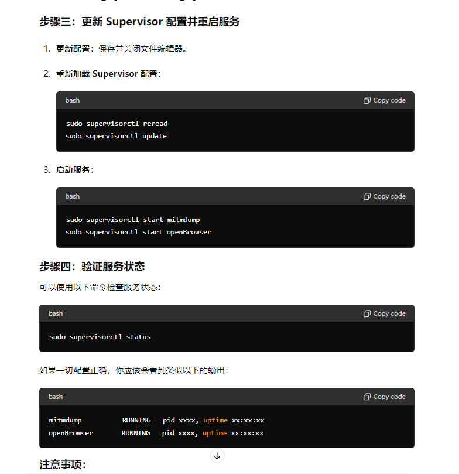

# 获取 websocket 中的实时数据，并通过自己的 socket 通道推送给前端

# mitmdump -s app.py #命令行模式

# python openBrowser.py #web 模式

# 环境/依赖

1. python3.8
2. mitmproxy 5.0.4
3. websockets 8.1
4. selenium 3.141.0
5. google-chrome-driver 2.45
6. chromedriver 2.45
7. supervisor 4.0.1

# 环境部署代码

```
<!-- python 3.8 -->
sudo apt install python3.8
sudo apt install python3-pip
python3 --version
pip --version
<!-- Google Chrome -->
wget https://dl.google.com/linux/direct/google-chrome-stable_current_amd64.deb
sudo apt install ./google-chrome-stable_current_amd64.deb
google-chrome --version
<!-- ChromeDriver -->
查看版本列表[1](https://googlechromelabs.github.io/chrome-for-testing/)[2](https://developer.chrome.com/docs/chromedriver/downloads)
wget https://chromedriver.storage.googleapis.com/91.0.4472.77/chromedriver_linux64.zip
unzip chromedriver_linux64.zip
sudo mv chromedriver /usr/local/bin/
sudo chmod +x /usr/local/bin/chromedriver
chromedriver --version
<!-- 安装其他依赖 -->
```

# 保活

```
<!-- 安装 -->
sudo apt-get update
sudo apt-get install supervisor
<!-- 保活脚本 -->
sudo nano /etc/supervisor/conf.d/my_programs.conf

```


